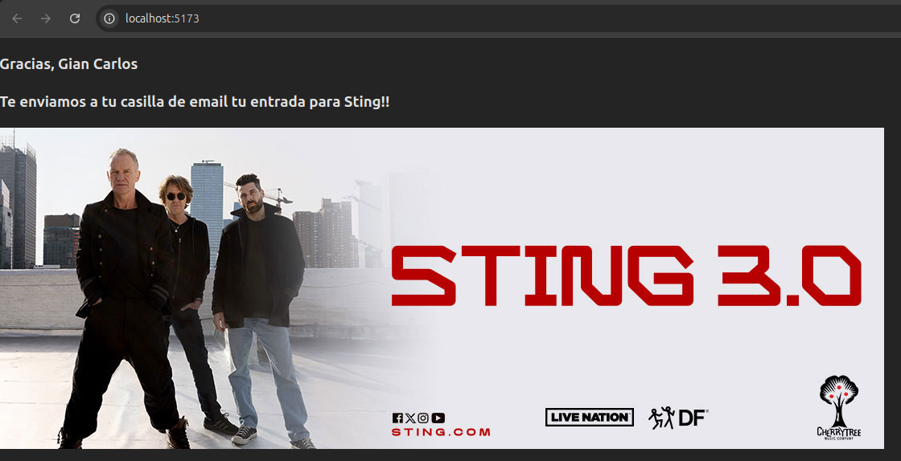

# Repaso Examen Parcial de FrontEnd III (REACT)

1. Mostrando la lista de espectaculos
2. Agregando un componente **Espectaculo**
3. Uso del Hook **useState** y agregamos un boton que active un formulario
4. Movemos el boton a Espectaculo y añadimos un nuevo prop(setisSelected)
5. Agregamos un nuevo componente **Form**
6. Implementamos el **Form**
7. Agregamos un nuevo componente **Card** para manejar las validaciones

### Resultado Final

